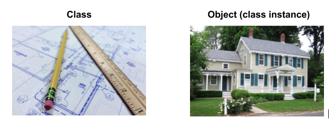

# Introduction to Object Oriented Programming

## What is OOP?
* Object-Oriented Programming
* Represent complex real-world things, consisting of numerous properties, capable of doing complex actions.
* A way of breaking our requirements into chunks that are more manageable than the whole
  * each chunk is **self-contained** yet potentially **reusable** by other programs, while working together as a whole with other chunks
  * chunks → **objects**
* when we code an object, we do so with a **class**
* class →  a blueprint of an object
* object → an **instance** of a class


> Think of a class as a blueprint –  you can't live in it, but you can build a house (an object) from it.

## Three Core Values of OOP
1. Encapsulation
2. Polymorphism
3. Inheritance


### Reasons for OOP
* self-contained - you can make changes/add features to your code without worrying about how other code interacts with it
* use other code without (i.e Android API) without knowing/caring how it works. i.e JUnit
* you can create different or multiple versions of a class without starting from scratch (extend the functionality of existing code).  i.e Calculator --> Scientific calculator


## Class
* a bunch of code that can contain methods, variables, loops, and all other java syntax
* a class is part of a package - most packages contain multiple java classes
* each new class (usually) is defined in it's own similarly nameed .java file
* once we define a class, we can use it to make as many objects as we want that use the class as their blueprint.

### Class Implementation
Consider the game Among Us. Among other classes, we need one to represent a Player.  Defining a class is a *class implementation*. When we  implement the Player class, we would do so in a file called Player.java

*insert demo Player class here* 


### Instance variables
* Variables defined within a class are called instance variables because each instance of the class (that is, each object of the class) contains its own copy of these variables. 
* Defines the information we want to keep/maintain about an object, i.e `name`, `health`, etc.
* The data for one object is separate and unique from the data for another. i.e each Player has a different name.
* An instance variable can be declared public or private or default (no modifier) (more on that later)

### Instance methods
* Methods defined within a class that represent what an object can do. i.e `walk()`, `performTask()`, `vote()`

### Constructor Method(s)
* special methods defined in a class, used to initialize the an object
* called when a new object is created
* the same name as the class
* no return value in the method signature
* can be defined with input parameters that are specified when an object is created.

*insert constructor of Player here*

## Class Instantiation - Creating Objects
Once again, a class is just a blueprint, not a usable object.  To make an object of the type `Player` from our `Player` class we need to instantiate it.  Objects are typically created within other classes, not within its own class definition.  In our example, we create a `Player` object within the `AmongUs` class.

```
Player player1;
player 1 = new Player("mrfabroa", "crewmate", "yellow", "fedora");
```   

In the lines above:
* we declare a variable of the type `Player` called `player1`
* the `new Player(...)` part is a call to the `constructor` method, passing in details of the player at the time of creation (instantiation)
* assignment operator in between means we assign the result of the constructor to our `player1` variable


