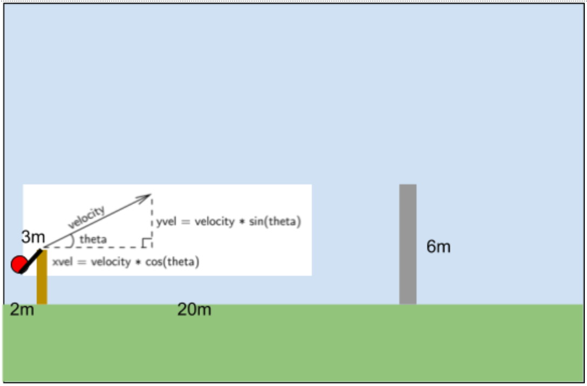

# Encapsulation

#### Learning Goals
* modularize a program down into classes using encapsulation principles

## Angry Birds
Consider the problem within the game Angry Birds – a projectile (a bird) is launched via a slingshot at the wall of a house containing pigs.  Let's say it takes 3 hits to the house's side wall for the wall to topple down.


### How could we simulate this scenario?
#### Assumed details
* height of the bird at the release point of the slingshot - 3 meters
* The wall is 20m away from the slingshot
* The wall is 6 metres high



#### General Idea
Every tenth of a second, compute the x-position and y-position of the bird and see if it has either hit the wall or hit the ground

### PseudoCode
```
Initialize the health of the wall

while health of wall > 0
	get the launch angle theta
  get the launch velocity
  initialize xpos, ypos
  calculate initial velocities xvel, yvel
  while bird has not hit the ground and bird has not hit the wall
	  update the xpos, ypos, and yvel for 0.1 seconds further into flight
    check if bird has hit the ground or hit the wall based on xpos, ypos

  if bird hit the wall
    decrement health of wall by 1

```

## Implementation 1 - [AngryBirds1.java](AngryBirds1.java)


