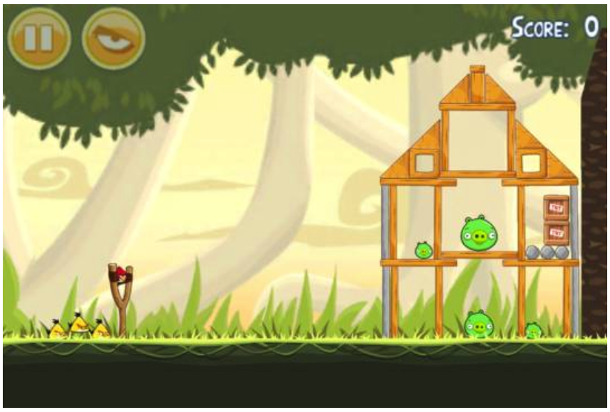
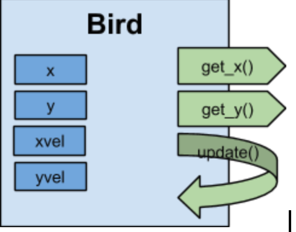

# Encapsulation

#### Learning Goals
* modularize a program down into classes using encapsulation principles

## Angry Birds
Consider the problem within the game Angry Birds – a projectile (a bird) is launched via a slingshot at the wall of a house containing pigs.  Let's say it takes 3 hits to the house's side wall for the wall to topple down.



### How could we simulate this scenario?
#### Assumed details
* height of the bird at the release point of the slingshot - 3 meters
* The wall is 20m away from the slingshot
* The wall is 6 metres high


#### General Idea
Every tenth of a second, compute the x-position and y-position of the bird and see if it has either hit the wall or hit the ground

### PseudoCode
```
Initialize the health of the wall

while health of wall > 0
	get the launch angle theta
  get the launch velocity
  initialize xpos, ypos
  calculate initial velocities xvel, yvel
  while bird has not hit the ground and bird has not hit the wall
	  update the xpos, ypos, and yvel for 0.1 seconds further into flight
    check if bird has hit the ground or hit the wall based on xpos, ypos

  if bird hit the wall
    decrement health of wall by 1

```

### Implementation 1 - [AngryBird1.java](AngryBird1.java)

### Implmentation 2 Object Oriented - [AngryBird2.java](AngryBird2.java)


## Encapsulation - A Separation of Concerns
* Encapsulation is known as a **separation of concerns**	 	 	 		
* The implementation details of an object are enclosed in the class definition, which insulates the rest of the program from having to deal with them 
* Striving for a separation of concerns is **good design**.
* keeping the internal workings of your code safe from interference from the programs that use it


### Encapsulation & Interface
When we define an object with a class, we define the rules for which the program is able to interact with the object
you’ll notice that we’ve created a number of “get” and a number “set” type functions, accessor and mutators, these methods comprise the interface of the object.


## How Do We Encapsulate?

### Getter and Setter Methods
Getter and Setter methods are methods that let you get and set the values of an object's attributes.
#### Getter Methods
A getter methods lets you get access to some attributes of an object, also known as **accessor** methods
standard to have a prefix `get` in the function name i.e `getSize()`  

#### Setter Methods
* Lets you set values of attributes of an object, also known and **modifier** methods
* standard to have a prefix `set` in the function name i.e `setSize()`
* no return value in a setter method (void)

## Private Methods and Variables
By default, all methods and instance variables we define for a class are accessible to classes within the same package(except subclasses), meaning they can be called by any instance of an object. Sometimes, we want to restrict usage of some methods and attributes from being used outside of a class. Defining an instance variable as `private` will limit visibility to within the class.


